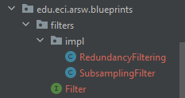
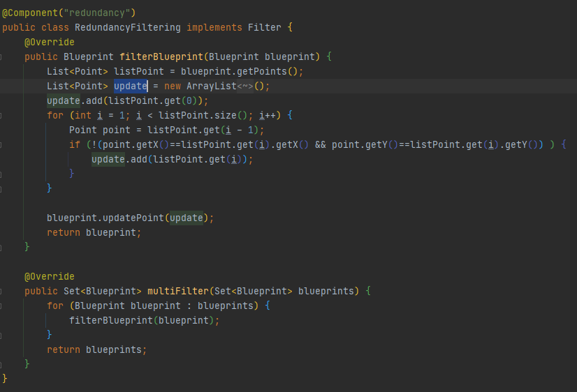
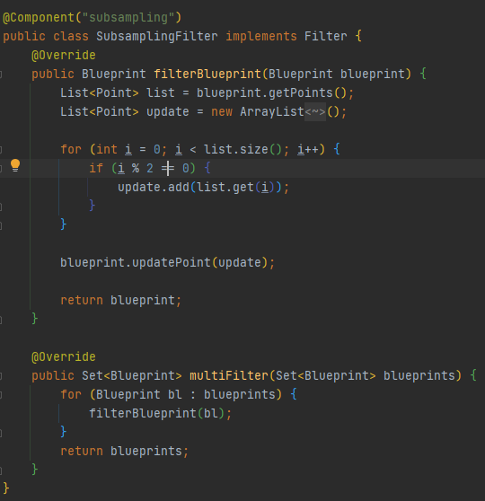
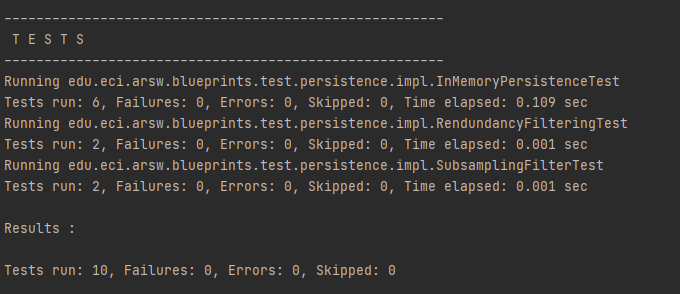
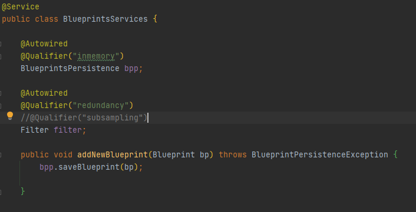

### Escuela Colombiana de Ingeniería

### Arquitecturas de Software

## Laboratorio Componentes y conectores  Middleware- gestión de planos

### Integrantes:

> Juan Sebastian Ramos Isaza.\
> Andres Mateo Calderon Ortega.

### Dependencias

* [Ejercicio introductorio al manejo de Spring y la configuración basada en anotaciones](https://github.com/ARSW-ECI-beta/DIP_DI-SPRING_JAVA-GRAMMAR_CHECKER)
  .

### Descripción

En este ejercicio se va a construír un modelo de clases para la capa lógica de una aplicación que permita gestionar
planos arquitectónicos de una prestigiosa compañia de diseño.

### Parte I.

1. Configure la aplicación para que funcione bajo un esquema de inyección de dependencias, tal como se muestra en el
   diagrama anterior.

   Lo anterior requiere:

    * Agregar las dependencias de Spring.
    * Agregar la configuración de Spring.
    * Configurar la aplicación -mediante anotaciones- para que el esquema de persistencia sea inyectado al momento de
      ser creado el bean 'BlueprintServices'.

   > RT: Se agregaron la anotacion @Component("inmemory") para la clase InMemoryBlueprintPersistence, y en la clase BlueprintsServices
   > las anotaciones @Autowired y @Qualifier("inmemory"), adiconalmente se creo el archivo applicationContext.xml en la carpeta
   > resources ubicada en el directorio main.

2. Complete los operaciones getBluePrint() y getBlueprintsByAuthor(). Implemente todo lo requerido de las capas
   inferiores
   (por ahora, el esquema de persistencia disponible 'InMemoryBlueprintPersistence') agregando las pruebas
   correspondientes en 'InMemoryPersistenceTest'.

   > RT : Se agrego a la interfaz "BlueprintsPersistence" el metodo "getBlueprintsByAuthor()" y se implemento en la clase
   > "InMemoryBlueprintPersistence" adiconalmente se generaron 4 pruebas 2 por metodo agregado.\
   > Impl:
   > 
   > Test:
   > 

3. Haga un programa en el que cree (mediante Spring) una instancia de BlueprintServices, y rectifique la funcionalidad
   del mismo: registrar planos, consultar planos, registrar planos específicos, etc.
   
4. Se quiere que las operaciones de consulta de planos realicen un proceso de filtrado, antes de retornar los planos
   consultados. Dichos filtros lo que buscan es reducir el tamaño de los planos, removiendo datos redundantes o
   simplemente submuestrando, antes de retornarlos. Ajuste la aplicación (agregando las abstracciones e implementaciones
   que considere) para que a la clase BlueprintServices se le inyecte uno de dos posibles 'filtros' (o eventuales
   futuros filtros). No se contempla el uso de más de uno a la vez:

    * Estructura de la solucion:

      
    * (A) Filtrado de redundancias: suprime del plano los puntos consecutivos que sean repetidos.

      

    * (B) Filtrado de submuestreo: suprime 1 de cada 2 puntos del plano, de manera intercalada.

      

5. Agrege las pruebas correspondientes a cada uno de estos filtros, y pruebe su funcionamiento en el programa de prueba,
   comprobando que sólo cambiando la posición de las anotaciones -sin cambiar nada más-, el programa retorne los planos
   filtrados de la manera (A) o de la manera (B).
   > Pruebas:
   > 
   > 
   > 
   > Cambio de anotaciones, se debe cambiar la anotacion qualifier:
   > 
   > 
   > 
   > Main en funcionamiento:
   > 
   > 
   > 
